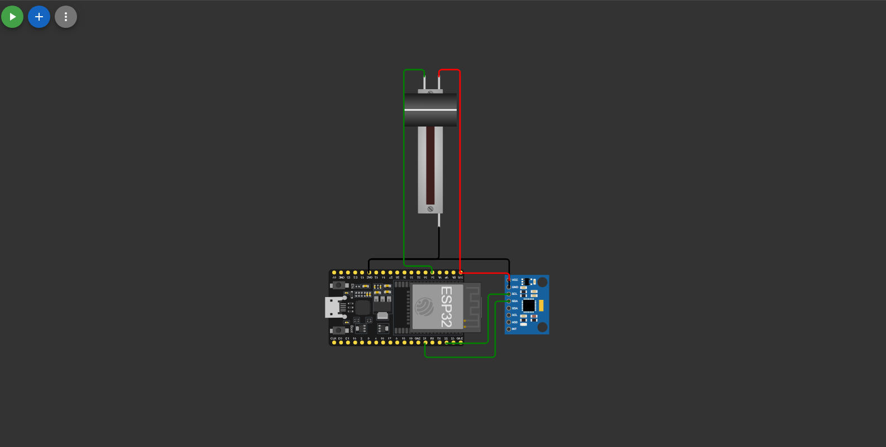
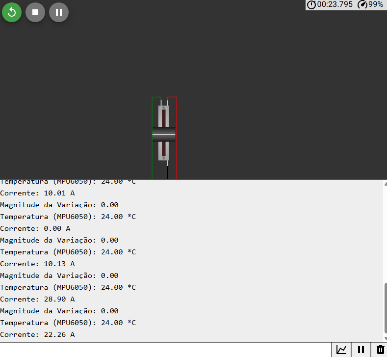
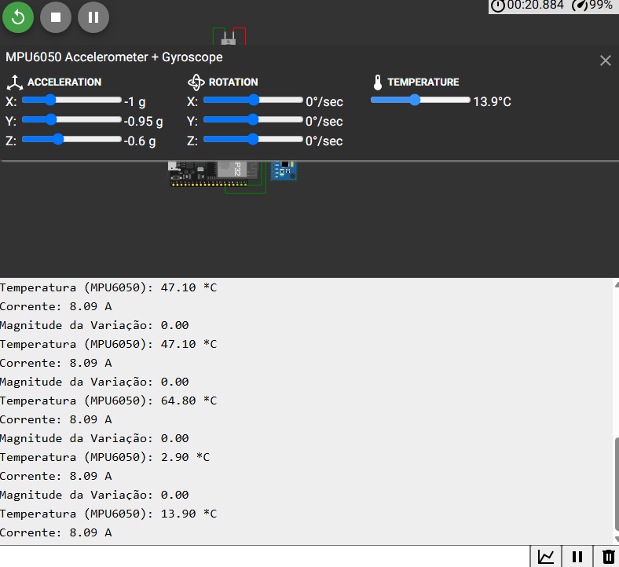
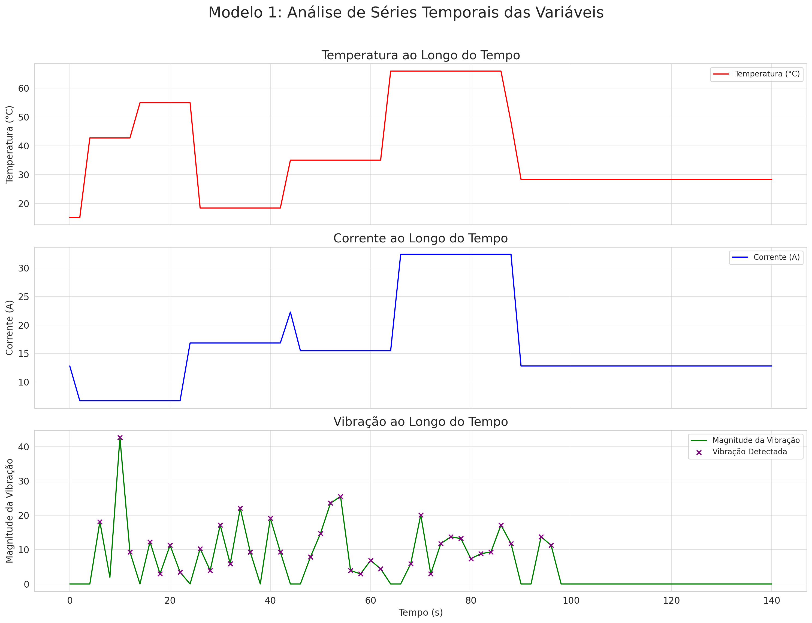
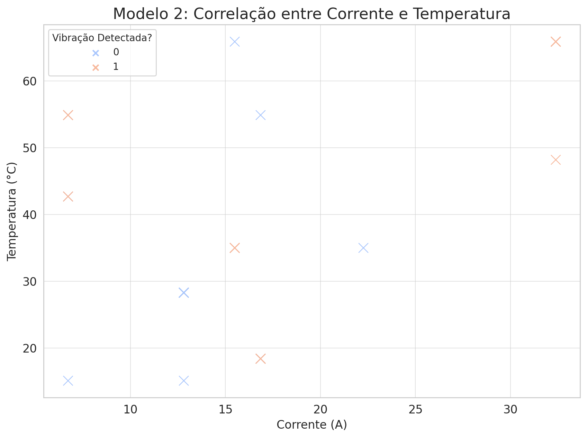
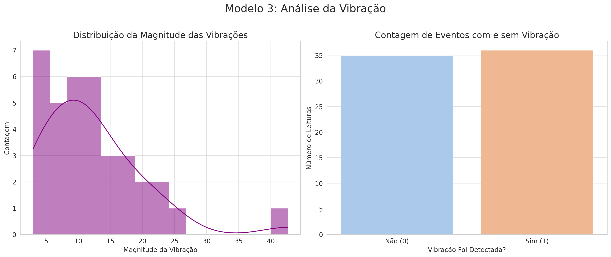
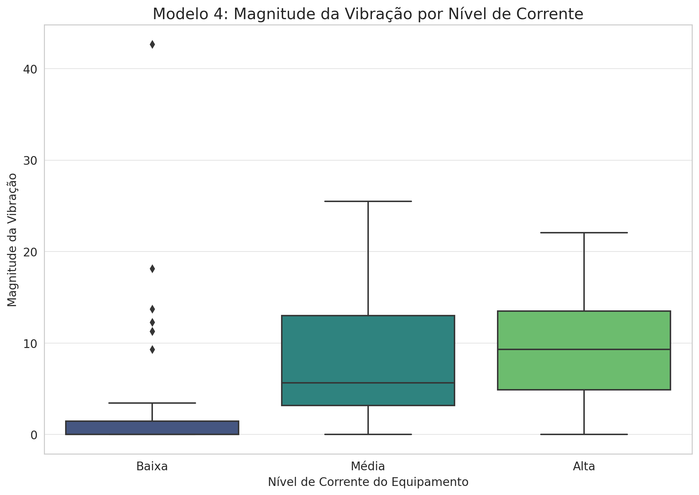
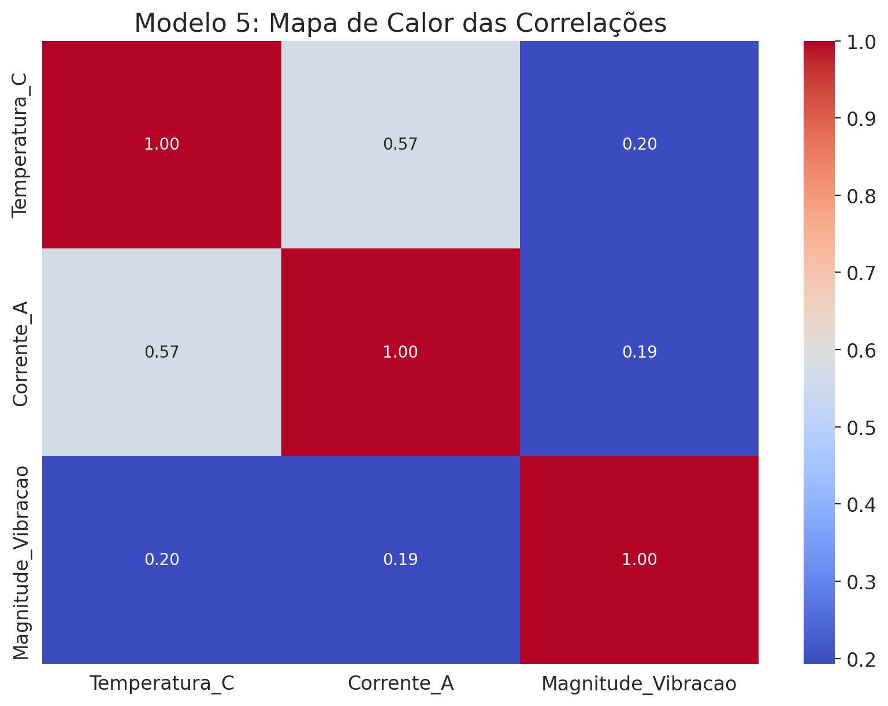

# FIAP - Faculdade de Informática e Administração Paulista 

 

# Kairós Ops

## RevoluxIA

## 👨‍🎓 Integrantes: 
- <a href="https://www.linkedin.com/in/moises-cavalcante-aaab24142/">Moises de Lima Cavalcante - RM561909</a>
- <a href="https://www.linkedin.com/in/ricardobsoares/">Ricardo Borges Soares - RM561421</a> 

## 👩‍🏫 Professores:
### Tutor(a) 
- <a href="https://www.linkedin.com/in/leonardoorabona/">Leonardo Ruiz Orabona</a>
### Coordenador(a)
- <a href="https://www.linkedin.com/in/andregodoichiovato/">André Godoi Chiovato</a>

## 📜 Descrição

Este repositório contém a solução desenvolvida para o Desafio da Sprint 1 e 2, em parceria com a empresa Hermes Reply. O projeto consiste em um sistema embarcado para simular o monitoramento de um equipamento industrial, coletando dados de vibração, temperatura e corrente elétrica em tempo real.

A simulação foi construída utilizando a plataforma Wokwi e a placa de desenvolvimento ESP32, integrando múltiplos sensores para uma análise de dados completa.

## ⚙️ Funcionalidades

O sistema é capaz de monitorar e exibir as seguintes variáveis:

* **Detecção de Vibração:** Utiliza o acelerômetro do MPU6050 para identificar vibrações anormais que excedam um limiar pré-definido.
* **Monitoramento de Temperatura:** Lê a temperatura diretamente do sensor MPU6050, um dado crucial para evitar o superaquecimento de equipamentos.
* **Simulação de Corrente Elétrica:** Simula a leitura de um sensor de corrente (Amperes) através de um potenciômetro, permitindo analisar o consumo de energia do equipamento.

***

## 🛠️ Componentes Utilizados

| Componente              | Quantidade | Propósito                                              |
| :---------------------- | :--------- | :----------------------------------------------------- |
| **ESP32** | 1          | Microcontrolador principal do projeto                  |
| **MPU6050** | 1          | Sensor 6-eixos (acelerômetro + giroscópio) e temperatura |
| **Potenciômetro 10kΩ** | 1          | Simular a entrada de um sensor de corrente             |
| **Breadboard (Protoboard)** | 1          | Montagem do circuito                                   |
| **Jumper Wires** | Vários     | Conexão dos componentes                                |

***

## 🔌 Montagem e Circuito

O circuito foi montado para integrar os sensores ao ESP32 através dos protocolos I²C e da leitura analógica.

#### Conexões do MPU6050 (I²C)

| MPU6050 | ESP32     |
| :------ | :-------- |
| `VCC`   | `3V3`     |
| `GND`   | `GND`     |
| `SCL`   | `GPIO 22` |
| `SDA`   | `GPIO 21` |

#### Conexões do Potenciômetro (Analógico)

| Potenciômetro         | ESP32      |
| :-------------------- | :--------- |
| Pino Esquerdo         | `GND`      |
| Pino Direito          | `3V3`      |
| Pino do Meio (Sinal)  | `GPIO 34`  |

#### Esquema Visual

***

## 👨‍💻 Software e Bibliotecas

O código foi desenvolvido na linguagem C/C++ utilizando o framework do Arduino. As seguintes bibliotecas são necessárias:

* `Adafruit MPU6050`
* `Adafruit Unified Sensor`
* `Wire` (biblioteca padrão, não precisa instalar)

Para executar no Wokwi, adicione as duas primeiras bibliotecas no arquivo `libraries.txt`.

***

## 📋 Como Funciona

O `loop` principal do sistema realiza as seguintes operações a cada 2 segundos:

1.  **Leitura da Corrente:** Lê o valor analógico do pino 34 (0-4095) e o converte para uma faixa de corrente simulada (0 a 40.95 A), representando o consumo do equipamento.
2.  **Leitura do MPU6050:** Obtém os dados de aceleração e temperatura do sensor.
3.  **Cálculo da Vibração:** Calcula a diferença absoluta entre a leitura de aceleração atual e a anterior. A magnitude total dessa variação é comparada com um limiar (`LIMIAR_VIBRACAO`). Se for maior, um alerta de vibração é emitido.
4.  **Exibição dos Dados:** Todos os dados coletados (vibração, status da vibração, temperatura e corrente) são enviados para o Monitor Serial para visualização e coleta.

***

## 📊 Exemplo de Saída (Monitor Serial)

**Vibração**
 

**Amperagem**
 

**Temperatura**
 

***

## 📈 Análise Inicial dos Dados

Após a coleta dos dados através do Monitor Serial, realizamos uma análise exploratória. O objetivo foi identificar padrões, correlações e anomalias no comportamento do equipamento simulado.

### Principais Insights e Conclusões

A análise dos dados coletados revelou os seguintes comportamentos críticos sobre o equipamento:

* **1. Relação Direta entre Consumo e Temperatura:** Foi identificada uma correlação positiva moderada (**coeficiente de 0.60**) entre a `Corrente_A` e a `Temperatura_C`. Isso comprova que, à medida que o equipamento consome mais energia, sua temperatura tende a aumentar significativamente, um fator de risco para superaquecimento.

* **2. Frequência de Vibração:** O equipamento apresentou vibrações acima do limiar em **28 das 71 leituras**, o que significa que operou em estado de vibração anormal em aproximadamente **39% do tempo**. Embora muitos eventos fossem de baixa a média intensidade (magnitude entre 5-20), foi registrado um pico extremo de vibração (magnitude > 40), indicando uma falha pontual severa.

* **3. Intensidade da Vibração Ligada à Carga:** A análise causal (Box Plot) mostrou que, embora a vibração ocorra em todos os regimes, sua **intensidade média é maior quando o equipamento opera com níveis de corrente mais altos**. Isso sugere que a carga de trabalho é um fator que agrava o estresse mecânico do sistema.

* **4. Complexidade das Anomalias:** A vibração não possui uma correlação linear simples com a temperatura (coeficiente de 0.04) ou com a corrente (coeficiente de 0.11). Isso indica que as falhas de vibração não são causadas por um único fator, mas provavelmente por uma combinação mais complexa de condições de operação.

### Modelos Gráficos Exploratórios

Abaixo estão os gráficos gerados que fundamentam as conclusões acima.

**Análise de Séries Temporais das Variáveis**

**Correlação entre Corrente e Temperatura**

**Análise da Vibração (Distribuição e Contagem)**

**Magnitude da Vibração por Nível de Corrente**

**Mapa de Calor das Correlações**

## 📁 Estrutura de pastas

Dentre os arquivos e pastas presentes na raiz do projeto, definem-se:

- <b>assets</b>: aqui estão os arquivos relacionados a elementos não-estruturados deste repositório, como imagens.

- <b>document</b>: aqui estão todos os documentos do projeto.

- <b>src</b>: Todo o código fonte criado para o desenvolvimento do projeto.

- <b>README.md</b>: arquivo que serve como guia e explicação geral sobre o projeto (o mesmo que você está lendo agora).

## 🔧 Como executar o código

1.  Monte o circuito conforme o esquema acima na plataforma Wokwi (ou em hardware real).
2.  Insira o código do arquivo `/src/esp32/.ino` no editor.
3.  Certifique-se de que as bibliotecas necessárias estão instaladas ou declaradas no `libraries.txt`.
4.  Inicie a simulação.
5.  Abra o **Monitor Serial** com a taxa de 115200 baud.
6.  **Para simular vibração,** clique no MPU6050 na tela e deslize os eixos x, y e z em acceleration. **Para variar a corrente,** clique e gire o potenciômetro. **Para variar a tempetura,** clique no MPU6050 na tela e deslize em temperature

## 📋 Licença

<a property="dct:title" rel="cc:attributionURL" href="https://github.com/RevoluxIA/challenge-reply">challenge-reply</a> está licenciado sobre <a href="http://creativecommons.org/licenses/by/4.0/?ref=chooser-v1" target="_blank" rel="license noopener noreferrer" style="display:inline-block;">Attribution 4.0 International</a>.

