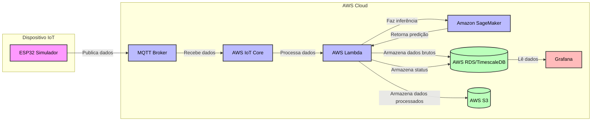
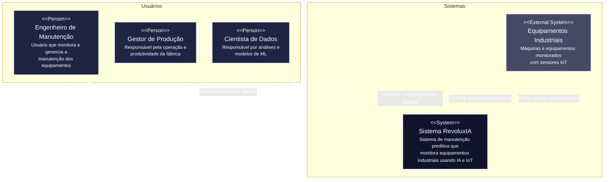
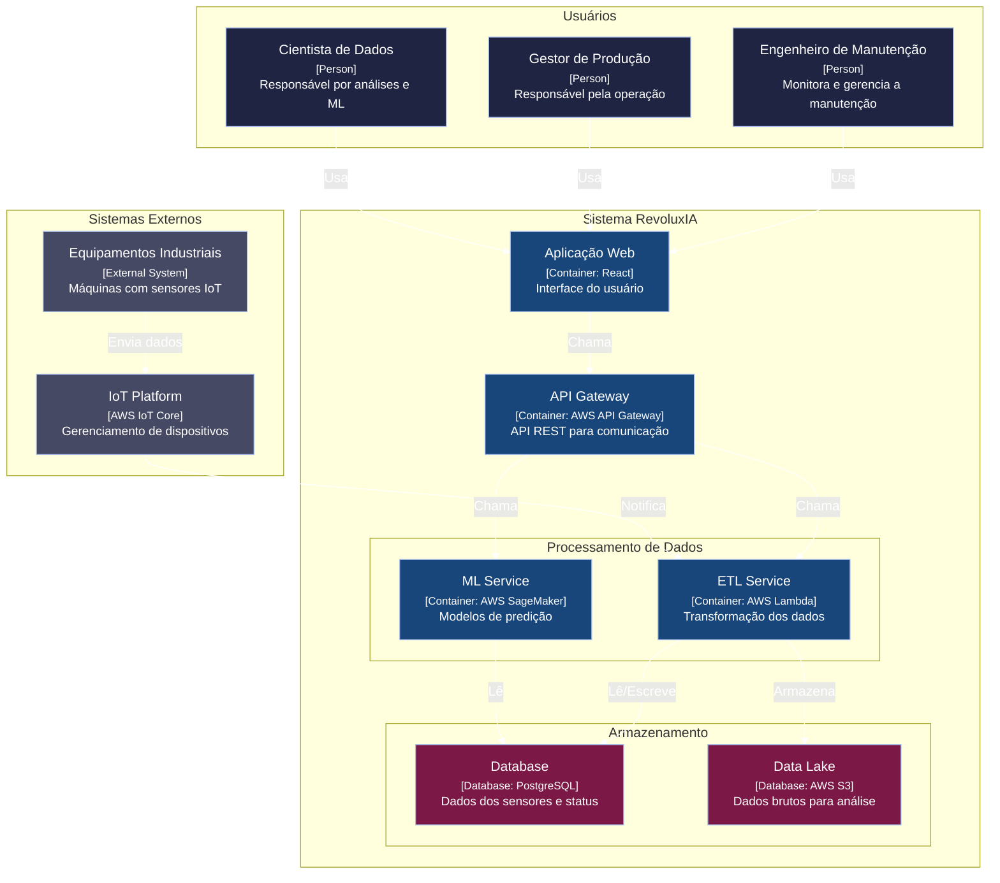
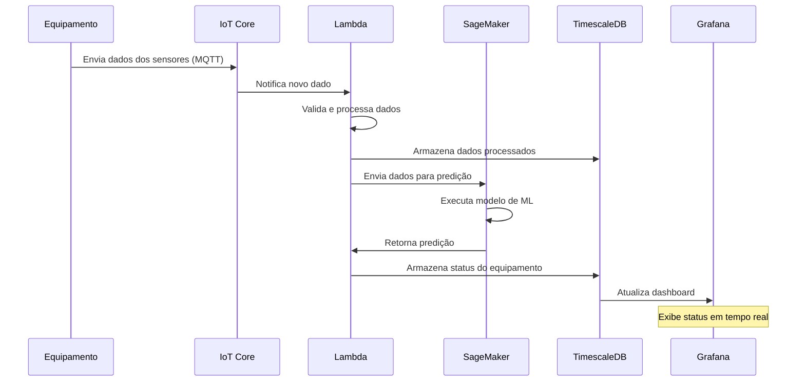
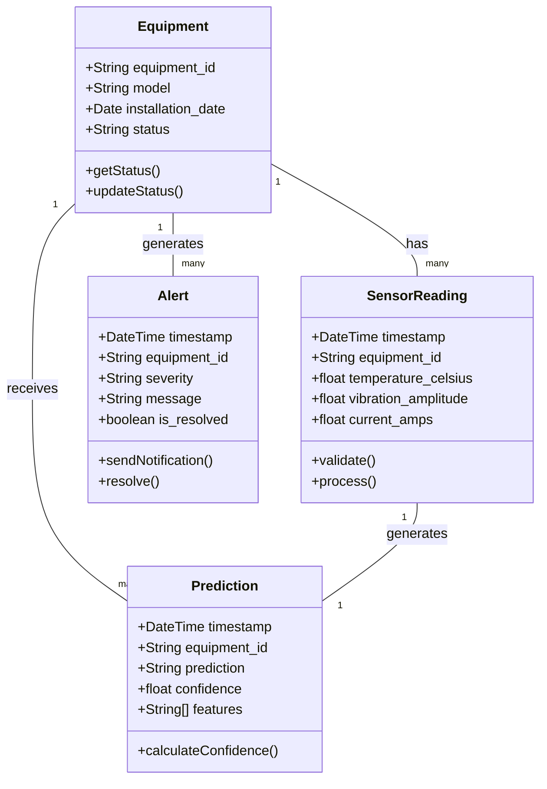

# 📄 Project Design Document (PDD)

# RevoluxIA

#### Moises de Lima Cavalcante
#### Ricardo Borges Soares

# Sumário

[1. Introdução](#c1)  
[2. Levantamento Teórico e Planejamento](#c2)  
[3. Engenharia de Dados](#c3)  
[4. Desenvolvimento do MVP](#c4)  
[5. Entrega Final e Apresentação](#c5)  
[6. Referências](#c6)  
[7. Anexos](#c7)

<br>

# <a name="c1"></a>1. Introdução

## 1.1. Contextualização da Empresa Parceira

A Hermes Reply é uma empresa especializada em soluções digitais para a indústria, combinando tecnologias como Inteligência Artificial, IoT (Internet das Coisas) e análise de dados. Focada na transformação digital do setor industrial, a empresa desenvolve serviços de controle inteligente de processos, monitoramento preditivo e otimização de operações para clientes de diversos segmentos.

O principal desafio enfrentado por seus clientes, e que este projeto se propõe a resolver, são as interrupções inesperadas em linhas de produção. Essas falhas geram perdas financeiras e operacionais significativas, destacando a necessidade de uma solução que permita a transição de um modelo de manutenção reativa para uma abordagem preditiva e proativa.

## 1.2. Objetivos do Projeto

O objetivo principal deste projeto é desenvolver uma proposta de solução de manutenção preditiva, batizada de "Sentinela Industrial", que utilize IA e IoT para monitorar equipamentos, prever falhas e sugerir ações preventivas.

* **Sprint 1 - Fundação e Planejamento:** Estabelecer a arquitetura técnica detalhada da solução, selecionar e justificar o stack tecnológico, realizar uma análise de riscos aprofundada e definir o escopo inicial através de User Stories e critérios de validação.
* **Sprint 2 - Engenharia de Dados:** Implementar o pipeline de dados completo, desde a geração de dados simulados realistas até o armazenamento em um banco de dados otimizado para séries temporais. Realizar a análise exploratória e garantir a qualidade e o tratamento dos dados.
* **Sprint 3 - Construção do MVP:** Desenvolver um Mínimo Produto Viável (MVP) funcional, integrando o pipeline de dados com um modelo de Machine Learning inicial e um dashboard de visualização. O objetivo é validar o fluxo completo e a geração de valor da solução.
* **Sprint 4 - Refinamento e Apresentação:** Iterar sobre o MVP com base no feedback da empresa parceira, refinar o modelo de ML, aprimorar a usabilidade do dashboard e preparar uma apresentação executiva e técnica do protótipo final.

---

# <a name="c2"></a>2. Levantamento Teórico e Planejamento (Sprint 1)

## 2.1. Tecnologias, Linguagens e Recursos Selecionados

| Categoria | Tecnologia/Recurso | Justificativa Técnica Detalhada |
| :--- | :--- | :--- |
| **Linguagem Principal** | **Python 3.9+** | Linguagem universal para aplicações de dados. O ecossistema maduro (Pandas, NumPy, Scikit-learn) e o suporte robusto em todas as principais plataformas de nuvem o tornam a escolha ideal para consistência em todo o projeto. |
| **Análise e ML** | **Scikit-learn, TensorFlow/Keras** | **Scikit-learn** para a implementação de modelos de baseline (Random Forest, Gradient Boosting) pela sua simplicidade e eficiência. **TensorFlow/Keras** para modelos de Deep Learning (LSTM, Redes Convolucionais 1D) capazes de capturar padrões temporais complexos nos dados dos sensores. |
| **Coleta de Dados** | **ESP32 (MicroPython)** | Excelente custo-benefício para prototipagem. O Wi-Fi integrado e o processamento dual-core permitem a coleta e o envio de dados via **MQTT**, um protocolo leve e eficiente, ideal para ambientes IoT com potencial restrição de rede. A programação em MicroPython agiliza o desenvolvimento. |
| **Banco de Dados** | **PostgreSQL c/ TimescaleDB** | **TimescaleDB** é uma extensão para PostgreSQL que o otimiza para séries temporais. Ele particiona os dados por tempo automaticamente (hypertables), o que acelera drasticamente as consultas em grandes volumes de dados de sensores, sendo superior a um PostgreSQL padrão ou bancos NoSQL genéricos para este caso de uso. |
| **Computação em Nuvem**| **AWS** | **IoT Core:** Gerencia a comunicação MQTT segura e escalável com os dispositivos. **Lambda:** Para processamento serverless e em tempo real (ETL). **S3:** Armazenamento de baixo custo para o Data Lake. **RDS (PostgreSQL):** Banco de dados gerenciado, simplificando a administração. **SageMaker:** Plataforma completa para o ciclo de vida de ML, desde a exploração (Jupyter) até o treinamento e deploy de modelos como endpoints. |
| **Visualização** | **Grafana** | Ferramenta open-source líder para visualização de séries temporais. Possui um conector nativo para PostgreSQL/TimescaleDB, permitindo a criação de dashboards em tempo real com alta performance e customização de alertas visuais, sendo ideal para o perfil de engenharia de manutenção. |


## 2.2. Cronograma Inicial do Projeto

| Sprint | Entregáveis e Tarefas Detalhadas |
| :--- | :--- |
| **Sprint 1** | **PDD Finalizado (v1.0)**, Repositório Git com estrutura de pastas, **Diagrama de Arquitetura C4 (Nível 1 e 2)**, Configuração inicial da conta AWS (IAM, VPC), Definição das User Stories e Critérios de Aceitação. |
| **Sprint 2** | **Script de simulação de dados em Python**, **Função Lambda de ETL** (deploy via SAM/Serverless Framework), **Hiper-tabela no TimescaleDB** configurada, **Jupyter Notebook de Análise Exploratória de Dados (EDA)** com gráficos e insights iniciais. |
| **Sprint 3** | **Modelo de Classificação (Random Forest) treinado no SageMaker**, **Endpoint de inferência** do modelo publicado, **Dashboard no Grafana** conectado ao RDS exibindo status dos equipamentos, **Script de integração** que envia novos dados para o endpoint e atualiza o status. |
| **Sprint 4** | **Modelo de LSTM** treinado para comparação de performance, **Dashboard refinado** com base no feedback, **Apresentação de slides (PPTX)** com a jornada do projeto, **Vídeo de demonstração (pitch)** da solução em funcionamento. |


## 2.3. Análise de Riscos

| Risco | Probabilidade | Impacto | Estratégia de Mitigação |
| :--- | :--- | :--- | :--- |
| **Atraso na obtenção do hardware (ESP32)** | Média | Médio | A arquitetura é desacoplada. Todo o pipeline de nuvem e ML será desenvolvido e testado com o script de simulação de dados, que emula o comportamento do dispositivo físico via MQTT. |
| **Complexidade do modelo de ML** | Média | Alto | Iniciar com um modelo de baseline (Random Forest) para garantir uma solução funcional rapidamente. Utilizar a performance deste modelo como métrica para justificar a evolução (ou não) para modelos mais complexos. |
| **Custos inesperados com a nuvem AWS** | Baixa | Médio | Utilização rigorosa do AWS Free Tier. Criação de **alertas de faturamento no AWS Budgets** para notificar quando os custos atingirem um limiar. Implementação de scripts para desligar recursos (como instâncias SageMaker) após o uso. |
| **Qualidade dos dados simulados** | Média | Médio | Utilizar **datasets públicos de manutenção preditiva (ex: NASA Turbofan Engine Degradation)** como referência para gerar dados sintéticos com distribuições e padrões de falha realistas. |
| **Viés no modelo de ML** | Média | Alto | Garantir que os dados de treinamento (simulados) sejam balanceados entre classes (Normal, Falha). Aplicar técnicas de validação cruzada e analisar a matriz de confusão para identificar e corrigir vieses. |


## 2.4. User Stories e Critérios de Validação

> **US-01:** Como **engenheiro de manutenção**, desejo **visualizar um dashboard com o status de saúde dos equipamentos em tempo real** para que eu possa **identificar rapidamente máquinas com risco de falha**.
* **Critérios de Validação:**
    * [ ] O dashboard deve exibir uma lista de equipamentos monitorados, identificados por um ID único.
    * [ ] Cada equipamento deve ter um indicador de status visualmente claro: VERDE (Normal), AMARELO (Alerta), VERMELHO (Crítico).
    * [ ] Ao clicar em um equipamento, gráficos com as séries temporais dos seus sensores (última hora) devem ser exibidos.

> **US-02:** Como **gestor de produção**, desejo **receber um alerta automático por e-mail quando um equipamento entrar em estado "Crítico"** para que eu possa **acionar a equipe de manutenção preventivamente**.
* **Critérios de Validação:**
    * [ ] Uma notificação via AWS SNS (e-mail) deve ser disparada sempre que o modelo classificar um equipamento como "Crítico".
    * [ ] O e-mail deve conter o ID do equipamento, o timestamp do alerta e os valores dos sensores que levaram à predição.

> **US-03:** Como **cientista de dados**, desejo **acessar o histórico completo de dados brutos dos sensores** para que eu possa **realizar análises aprofundadas e treinar novos modelos de ML**.
* **Critérios de Validação:**
    * [ ] Todos os dados recebidos pelo IoT Core devem ser armazenados em um bucket S3.
    * [ ] Os dados no S3 devem ser particionados por data (ano/mês/dia) para otimizar consultas.
    * [ ] O acesso ao bucket deve ser controlado via políticas do IAM.

---

# <a name="c3"></a>3. Engenharia de Dados (Sprint 2)

## 3.1. Busca de Dados

A fonte primária de dados para o desenvolvimento será um **script de simulação em Python**. Este script irá gerar dados para múltiplos equipamentos virtuais, publicando-os em um tópico MQTT no AWS IoT Core.

**Schema dos Dados Gerados (JSON):**
```json
{
  "equipment_id": "MOTOR-001",
  "timestamp": "2025-06-12T03:16:00Z",
  "sensors": {
    "temperature_celsius": 85.5,
    "vibration_amplitude_mm_s": 2.1,
    "current_amps": 5.2
  }
}
```
O script irá simular operações normais e injetar padrões de anomalia, como aumento gradual da temperatura e picos de vibração, antes de uma "falha" programada.


## 3.2. Tratamento e Qualidade dos Dados

O tratamento de dados (ETL) será orquestrado por uma função **AWS Lambda**:
* **Enriquecimento:** Adiciona um `ingestion_timestamp` para controle de latência.
* **Validação de Schema:** Verifica se o JSON recebido contém todos os campos e tipos de dados esperados. Mensagens malformadas são enviadas para uma Dead-Letter Queue (DLQ) para análise.
* **Tratamento de Outliers:** Aplicação de um filtro básico (ex: Z-score) para identificar leituras anômalas que não representam o processo.
* **Armazenamento Duplo:** O dado validado é inserido na hiper-tabela do TimescaleDB e, simultaneamente, o dado bruto original é persistido no S3 Data Lake (formato Parquet) para otimização de custo e performance em análises futuras.

## 3.3. Análises Iniciais (Data Science)

A Análise Exploratória de Dados (EDA) será realizada em um notebook Jupyter no SageMaker, conectado ao S3.
* **Análise Univariada:** Geração de histogramas e boxplots para cada sensor para entender suas distribuições.
* **Análise de Série Temporal:** Plotagem dos dados ao longo do tempo para identificar visualmente tendências, sazonalidade e pontos de mudança.
* **Análise Bivariada:** Criação de matrizes de correlação e scatter plots para investigar a relação entre diferentes sensores (ex: Temperatura vs. Corrente).

## 3.4. Modelagem de Banco de Dados

Utilizaremos o TimescaleDB sobre PostgreSQL. A estrutura principal será:

**Tabela: `sensor_readings` (Hiper-tabela)**
| Nome da Coluna | Tipo de Dado | Descrição |
| :--- | :--- | :--- |
| `timestamp` | `TIMESTAMPTZ` | Chave primária e dimensão de particionamento da hiper-tabela. |
| `equipment_id` | `VARCHAR(50)` | Identificador do equipamento (ex: 'MOTOR-001'). Chave estrangeira para `equipments`. |
| `temperature_celsius` | `DOUBLE PRECISION` | Leitura do sensor de temperatura. |
| `vibration_amplitude` | `DOUBLE PRECISION` | Leitura do sensor de vibração. |
| `current_amps` | `DOUBLE PRECISION`| Leitura do sensor de corrente elétrica. |

**Tabela: `equipments`**
| Nome da Coluna | Tipo de Dado | Descrição |
| :--- | :--- | :--- |
| `equipment_id` | `VARCHAR(50)` | Chave primária. |
| `model` | `VARCHAR(100)` | Modelo do equipamento. |
| `installation_date`| `DATE` | Data de instalação. |

---

# <a name="c4"></a>4. Desenvolvimento do MVP (Sprint 3)

## 4.1. Implementação Prática do MVP

O MVP será considerado concluído ("Definition of Done") quando atender aos seguintes critérios:
* O fluxo de dados simulados é visível no dashboard do Grafana com uma latência inferior a 15 segundos.
* O modelo Random Forest treinado no SageMaker atinge uma acurácia de no mínimo 85% no set de validação.
* O dashboard exibe o status (Normal/Alerta/Crítico) de pelo menos 3 equipamentos virtuais, atualizado conforme as predições do modelo.

## 4.2. Integração de Componentes

O fluxo de dados será: **ESP32 (Simulador)** -> **MQTT** -> **AWS IoT Core** -> **AWS Lambda** -> **(AWS RDS/TimescaleDB & AWS S3)**. Para inferência, a Lambda também fará uma chamada **HTTPS** para o endpoint do **SageMaker**, receberá a predição e a armazenará em uma tabela de status no RDS, que será lida pelo **Grafana**.



## 4.3. Validação com a Empresa Parceira

A validação ocorrerá através de uma **Sessão de Demonstração Interativa** na Sprint Review. Será apresentado o dashboard funcional e o fluxo de alertas. O feedback será coletado através de um questionário estruturado com perguntas sobre a clareza, relevância e usabilidade das informações apresentadas, guiando o backlog de refinamento da Sprint 4.

---

# <a name="c5"></a>5. Entrega Final e Apresentação (Sprint 4)

## 5.1. Refinamento da MVP

Com base no feedback, os ajustes planejados incluem:
* Implementação de um modelo mais avançado (LSTM) para comparar a performance preditiva com o baseline.
* Adição de uma página de "análise de causa raiz" no dashboard, mostrando os dados que levaram a um alerta específico.
* Otimização das queries do Grafana para garantir a performance do dashboard com um volume de dados maior.

## 5.2. Apresentação do Protótipo

A solução final será comunicada através de:
* **Apresentação Executiva:** Focada no problema de negócio, na solução proposta e no ROI (Retorno sobre Investimento) potencial.
* **Demonstração Técnica ao Vivo:** Mostrando o fluxo completo da solução em tempo real.
* **Relatório Final:** Este documento (PDD) atualizado e consolidado.
* **Vídeo Pitch (2 minutos):** Um resumo conciso e impactante do projeto.

# <a name="c6"></a>6. Referências

* AWS. (2024). *AWS Well-Architected Framework*.
* Hermes Reply. (2024). *Site Institucional*. [https://www.reply.com/hermes-reply/pt](https://www.reply.com/hermes-reply/pt)
* Nascimento, F. A., & Barchi, F. (2019). *NASA Turbofan Engine Degradation Simulation Data Set*. NASA.
* Timescale. (2024). *TimescaleDB Documentation*.

<br>

# <a name="c7"></a>7. Anexos
### Diagram C4 - Nível 1
---

### Diagram C4 - Nível 2

### Diagrama de sequência

### Diagram de classes

