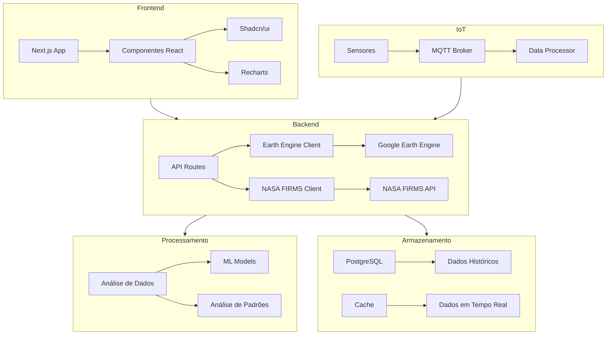
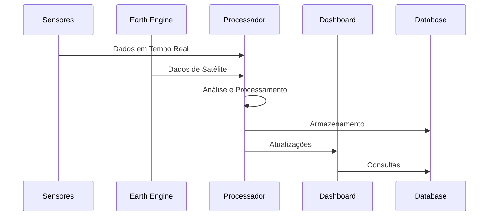

# 🌍 Sistema de Monitoramento de Desastres Naturais

Sistema preditivo e de monitoramento de desastres naturais utilizando IoT, machine learning e análise de dados em tempo real.

## 📋 Índice
- [Visão Geral](#visão-geral)
- [Arquitetura do Sistema](#arquitetura-do-sistema)
- [Componentes Principais](#componentes-principais)
- [Fluxo de Dados](#fluxo-de-dados)
- [Tecnologias Utilizadas](#tecnologias-utilizadas)
- [Instalação e Configuração](#instalação-e-configuração)
- [Uso do Sistema](#uso-do-sistema)
- [Segurança](#segurança)
- [Monitoramento](#monitoramento)

## 🎯 Visão Geral

O sistema é uma solução completa para monitoramento e previsão de desastres naturais, combinando:
- Dados de satélite (Google Earth Engine)
- Sensores IoT
- Análise preditiva
- Visualização em tempo real
- Sistema de alertas

### Tipos de Desastres Monitorados
- 🔥 Incêndios
- 🌊 Inundações
- 🌵 Secas
- 🏔️ Deslizamentos
- 🌪️ Tempestades

## 🏗️ Arquitetura do Sistema

## 🧩 Componentes Principais

### 1. Frontend (Next.js)
- **Dashboard Interativo**
  - Mapa de calor em tempo real
  - Gráficos de tendências
  - Alertas e notificações
  - Painéis de controle

### 2. Backend (Node.js/TypeScript)
- **APIs de Integração**
  - Google Earth Engine
  - NASA FIRMS
  - Sensores IoT
- **Processamento de Dados**
  - Análise de padrões
  - Detecção de anomalias
  - Previsões

### 3. IoT e Sensores
- **Tipos de Sensores**
  - Pluviômetro
  - Nível d'água
  - Umidade
  - Temperatura
- **Protocolos**
  - MQTT
  - HTTP/HTTPS

### 4. Banco de Dados
- **PostgreSQL**
  - Tabelas de desastres
  - Dados de sensores
  - Previsões
  - Alertas

## 🔄 Fluxo de Dados

## 🛠️ Tecnologias Utilizadas

### Frontend
- Next.js 14 (App Router)
- TypeScript
- Tailwind CSS
- Shadcn/ui
- Recharts
- React Query

### Backend
- Node.js
- TypeScript
- Google Earth Engine API
- NASA FIRMS API
- MQTT

### Infraestrutura
- PostgreSQL
- Redis (Cache)
- Docker
- GitHub Actions

## 🔒 Segurança

- Autenticação JWT
- HTTPS/TLS
- Rate Limiting
- Validação de Dados
- Sanitização de Inputs
- Criptografia de Dados Sensíveis

## 📊 Monitoramento

- Logs Estruturados
- Métricas de Performance
- Alertas de Sistema
- Monitoramento de Sensores
- Dashboard de Status